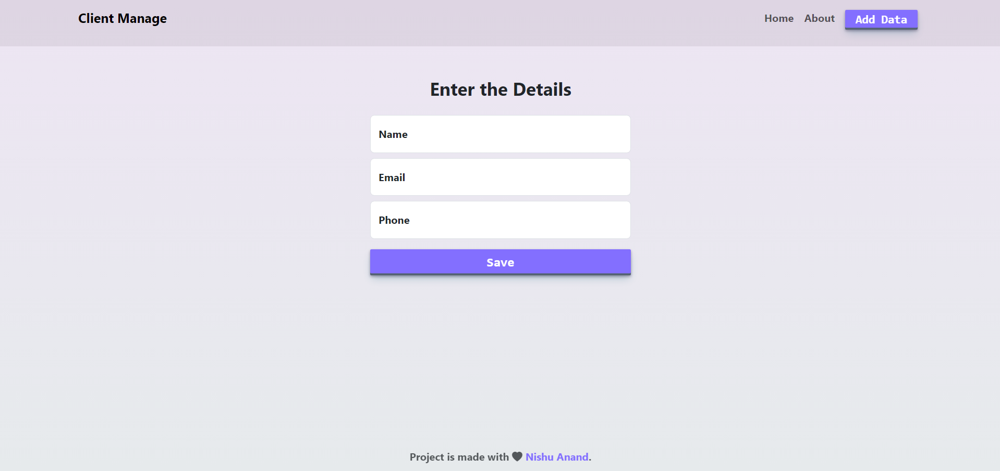
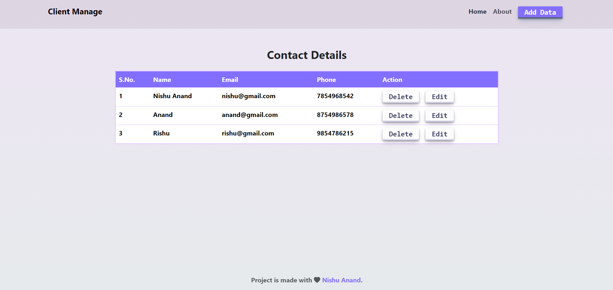
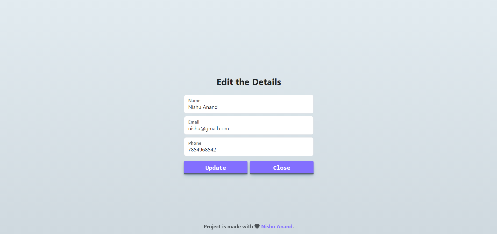

# Clients Management Application

This repository contains a clients management application built with React and Vite for the frontend, and Firebase for the backend. The application is designed to perform CRUD (Create, Read, Update, Delete) operations on client data, with real-time alerts using Toastify for various operations.

## Table of Contents

- [Features](#features)
- [Technologies Used](#technologies-used)
- [Usage](#usage)
- [Screenshots](#screenshots)
- [Demo](#demo)
- [Installation](#installation)


## Features

- **React with Vite**: Utilizes the fast and optimized Vite build tool for the React frontend.
- **Firebase**: Serves as the backend to handle data storage and authentication.
- **CRUD Operations**: Allows creating, reading, updating, and deleting client data.
- **Toastify**: Provides relevant and user-friendly alerts for different operations performed on the data.
- **Bootstrap**: Helps with the responsiveness of container and form arrangements.


## Technologies Used

- **React**: JavaScript library for building user interfaces.
- **Vite**: Next-generation frontend tooling for fast and optimized builds.
- **Firebase**: Backend as a Service (BaaS) for database and authentication.
- **Toastify**: Library for displaying beautiful and customizable toast notifications.
- **Bootstrap**: A popular CSS framework for developing responsive and mobile-first websites.

## Usage
**Instructions on how to use the application. For example:**

- **Add Client:** Fill out the client form and submit to add a new client.
- **View Clients:** See a list of all clients with their details.
- **Edit Client:** Click on the edit button next to a client to update their information.
- **Delete Client:** Click on the delete button next to a client to remove them from the list.
- **Alerts:** Receive notifications for each operation (add, update, delete) performed.


## Screenshots





## Demo

Check out the live demo [here](https://react-contact-ecc54.web.app/).

## Installation

- Check out link for React Vite installation [here](https://vitejs.dev/guide/).
- For Firebase connection check out [here](https://firebase.google.com/docs/web/setup).

 **Clone the repository:**

   ```bash
   git clone https://github.com/your-username/clients-management.git
   cd clients-management
